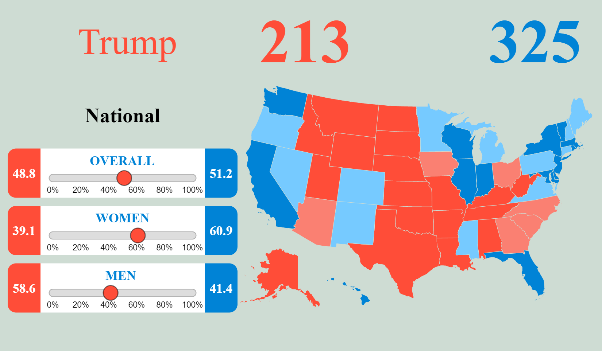

# October Surprise

[Live Site][gh-pages]

[gh-pages]: https://lesredfield.github.io/october-surprise/

An interactive electoral forecast tool for the 2016 presidential election. D3.js brings polling data to life through a map-based interface, allowing users to simulate electoral preferences for specific voting groups and states, and view real time changes to the overall electoral forecast.

Grab the overall national poll slider and watch as the electoral forecast and map update accordingly. Click a specific state to see how local changes to presidential preference affects the overall race to 270 electoral votes.

`function updateStateColor(state, color) {
  d3.select("#statesvg").select(state)
    .style("fill", color);
}`

D3.js is used here not only for the map elements, but also the interactive sliders and the forecast elements as well. The library affords great control over the final visual result (in addition to the underlying dynamic data interactivity).